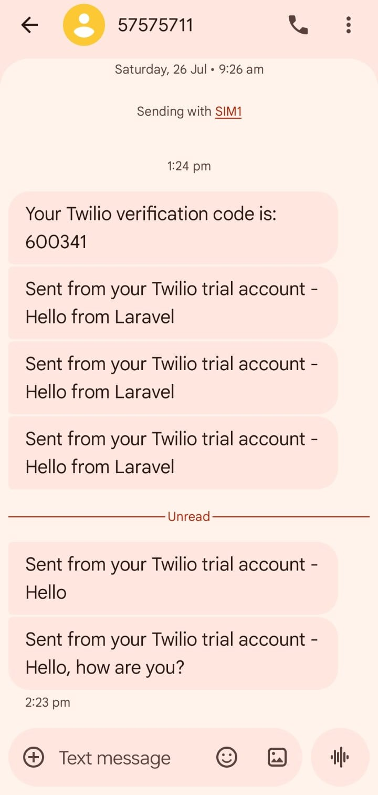

# PHP_Laravel12_SMS

## Introduction

**PHP_Laravel12_SMS** is a modern Laravel 12 application designed to demonstrate seamless SMS integration using a clean and scalable architecture.

The project leverages the **tzsk/sms** package along with the Twilio API to enable real-time SMS delivery. It showcases how Laravel applications can integrate external communication services efficiently while maintaining clean code structure and flexibility.

This system can be extended for real-world use cases such as OTP verification, user authentication, notifications, and alert systems.

The project follows Laravel best practices including controller-based logic, configuration-driven service integration, and modular design, making it suitable for both learning and production-level applications.

---

## Project Overview

This project provides a simple yet powerful interface to send SMS messages dynamically using user input.

### Key Features:

- Send SMS to any valid phone number
- Integration with Twilio SMS gateway
- Clean and minimal user interface using Tailwind CSS
- Input validation and error handling
- Configurable SMS drivers via environment settings

### How It Works:

1. User enters a phone number and message
2. Request is sent to the controller
3. The controller processes and formats the number
4. SMS is sent via the tzsk/sms package using Twilio API
5. Success or error message is displayed to the user

This project serves as a foundation for building advanced systems such as OTP authentication, bulk messaging, and notification services.

---

##  Requirements

Before starting, make sure you have:

* PHP >= 8.2
* Composer
* Node.js & npm
* MySQL or SQLite
* Laravel CLI (optional)

---

##  Step 1: Create Laravel 12 Project

```bash
composer create-project laravel/laravel PHP_Laravel12_SMS "12.*"
cd PHP_Laravel12_SMS
```
---

## Step 2: Install Twilio SDK

```bash
composer require twilio/sdk
```
---

## Step 3: Install SMS Package

We will use the tzsk/sms package.

```bash
composer require tzsk/sms
```

---

## Step 4: Publish Configuration

```bash
php artisan vendor:publish --provider="Tzsk\Sms\SmsServiceProvider"
```

This will create:

```
config/sms.php
```

---

## Step 5: Configure SMS Provider

Open:

```
config/sms.php
```

```
'default' => env('SMS_DRIVER', 'twilio'),

'drivers' => [

    'twilio' => [
        'driver' => 'twilio',
        'sid' => env('TWILIO_SID'),
        'token' => env('TWILIO_TOKEN'),
        'from' => env('TWILIO_FROM'),
    ],

],
```

---

## Step 6: Setup Environment

Open `.env`:

```env
APP_NAME=LaravelSMS
APP_ENV=local
APP_KEY=base64:...
APP_DEBUG=true
APP_URL=http://localhost
```

## Step 7: Create Twilio Account

- Go to Twilio

- Sign up

- Get:

```
Account SID
Auth Token
Phone Number
```
---

## Step 8: Update .env

```.env
SMS_DRIVER=twilio

TWILIO_SID=your_sid
TWILIO_TOKEN=your_token
TWILIO_FROM=your_twilio_number (Twilio given number)
```
---

## Step 9: Create SMS Controller

```bash
php artisan make:controller SmsController
```

File: `app/Http/Controllers/SmsController.php`

```php
<?php

namespace App\Http\Controllers;

use Illuminate\Http\Request;
use Tzsk\Sms\Facades\Sms;

class SmsController extends Controller
{
    public function sendSms(Request $request)
    {
        $request->validate([
            'number' => 'required',
            'message' => 'required',
        ]);

        // Ensure number has country code
        $number = $request->number;

        if (!str_starts_with($number, '+')) {
            $number = '+91' . $number; // default India
        }

        try {
            Sms::via('twilio')->send($request->message, function ($sms) use ($number) {
                $sms->to($number);
            });

            return back()->with('success', '✅ SMS sent successfully!');
        } catch (\Exception $e) {
            return back()->with('error', '❌ Error: ' . $e->getMessage());
        }
    }
}
```

---

## Step 10: Create Routes

File: `routes/web.php`

```php
<?php

use Illuminate\Support\Facades\Route;
use App\Http\Controllers\SmsController;

Route::get('/', function () {
    return view('welcome');
});

Route::get('/sms', function () {
    return view('sms');
});
Route::post('/sms/send', [SmsController::class, 'sendSms']);
```

---

## Step 11: Create Blade View

File: `resources/views/sms.blade.php`

```html
<!DOCTYPE html>
<html lang="en">

<head>
    <meta charset="UTF-8">
    <meta name="viewport" content="width=device-width, initial-scale=1.0">
    <title>Send SMS</title>

    <!-- Tailwind CDN -->
    <script src="https://cdn.tailwindcss.com"></script>
</head>

<body class="bg-gradient-to-br from-indigo-500 via-purple-500 to-pink-500 min-h-screen flex items-center justify-center">

    <div class="bg-white shadow-2xl rounded-2xl w-full max-w-md p-8">

        <!-- Heading -->
        <h2 class="text-2xl font-bold text-center text-gray-800 mb-6">
            📩 Send SMS
        </h2>

        <!-- Success Message -->
        @if(session('success'))
        <div class="bg-green-100 text-green-700 p-3 rounded mb-4 text-sm">
            {{ session('success') }}
        </div>
        @endif

        @if(session('error'))
        <div class="bg-red-100 text-red-700 p-3 rounded mb-4 text-sm">
            {{ session('error') }}
        </div>
        @endif

        <!-- Form -->
        <form method="POST" action="/sms/send" class="space-y-5">
            @csrf

            <!-- Phone Number -->
            <div>
                <label class="block text-gray-600 text-sm mb-1">Phone Number</label>
                <input
                    type="text"
                    name="number"
                    placeholder="+919876543210"
                    class="w-full px-4 py-2 border rounded-lg focus:ring-2 focus:ring-indigo-400 focus:outline-none"
                    required>
            </div>

            <!-- Message -->
            <div>
                <label class="block text-gray-600 text-sm mb-1">Message</label>
                <textarea
                    name="message"
                    rows="4"
                    placeholder="Type your message..."
                    class="w-full px-4 py-2 border rounded-lg focus:ring-2 focus:ring-indigo-400 focus:outline-none"
                    required></textarea>
            </div>

            <!-- Button -->
            <button
                type="submit"
                class="w-full bg-indigo-600 hover:bg-indigo-700 text-white py-2 rounded-lg font-semibold transition duration-300">
                🚀 Send SMS
            </button>
        </form>

    </div>

</body>

</html>
```

---

## Step 12: Run Application

```bash
php artisan serve
```

Open:

```
http://127.0.0.1:8000/sms
```
---

## Output




---

## Project Structure

```
PHP_Laravel12_SMS/
│
├── app/
│   └── Http/
│       └── Controllers/
│           └── SmsController.php
│
├── config/
│   └── sms.php
│
├── resources/
│   └── views/
│       └── sms.blade.php
│
├── routes/
│   └── web.php
│
├── storage/
│    └── logs/
│
└──.env
```

---

Your PHP_Laravel12_SMS Project is now ready!
